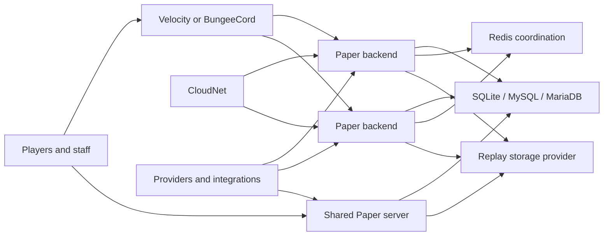
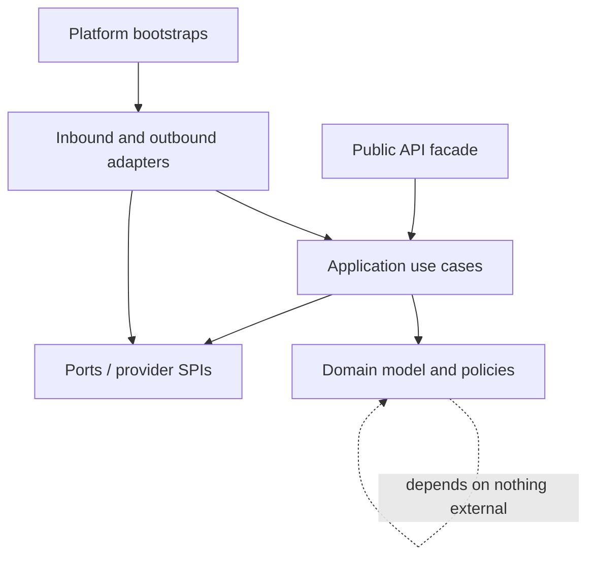
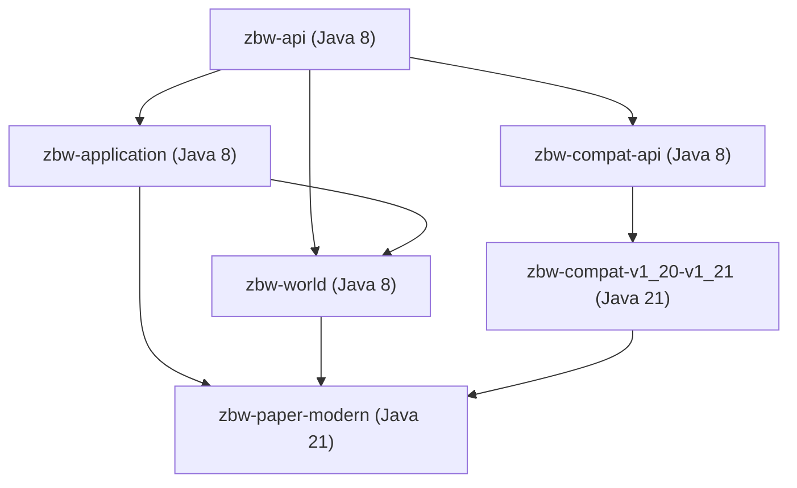

# ZartraBedWars Architecture

## 1. Architectural drivers

This architecture implements all 672 semantic requirements in the PRD and addon catalogue plus every normative `MP-L####` child in the atomic coverage matrix. Paper 1.21.1/Java 21 remains the primary behavior baseline and Paper 1.21.11 is the certified upper baseline; separately compiled adapters and exact toolchains cover the mandatory server matrix from 1.8.8 through 1.21.11 without platform logic in core. It supports both `SHARED_SERVER` and `SCALABLE_PROXY`, high event volume, structured replay/evidence, multi-store persistence and an addon ecosystem.

Non-negotiable qualities are deterministic game behavior, no blocking I/O on a server tick thread, idempotent distributed mutations, bounded resource use, least privilege, secret redaction, schema/version compatibility and observable recovery.

## 2. System context and deployment

### Shared-server mode

One Paper process owns many arena instances and worlds. The arena scheduler partitions work by arena, limits simultaneous resets/loads, unloads inactive worlds and never assumes one arena per JVM. SQLite is allowed only here or in a single-writer utility role. The target inventory is 100+ configured arenas and 40+ managed worlds; the reference load test uses 10 active arenas.

### Scalable-proxy mode

Paper backends host one or more arenas/groups. The proxy is the ingress/router; Redis is the ephemeral coordination and invalidation plane; SQL is authoritative durable data; replay payload storage is separate. CloudNet is optional service discovery/scaling. Each backend advertises a versioned capability/health document and drains before removal. Cross-server queue, party, private-game, rejoin and play-again operations use the same domain services as shared mode.

No gameplay rule belongs in a proxy, Redis subscriber or CloudNet adapter. Those components route commands/messages into application ports.

## 3. Layering and dependency rule

- **Domain:** aggregates, value objects, policies, state machines, domain events. It imports no Bukkit/Paper/NMS, JDBC, Redis, proxy or plugin-provider types.
- **Application:** use cases, transactions, orchestration, authorization intents, idempotency and ports. It may depend on domain and stable API contracts.
- **Adapters:** Paper/proxy commands and listeners, repositories, Redis, providers, packets, GUIs and external APIs. They translate; they do not own business rules.
- **Bootstrap:** DI graph, lifecycle, capability negotiation and configuration. No service locator is visible to domain or addons.
- **Public API:** immutable DTOs/read views, commands/use-case facades, registration SPIs and documented events. Internal aggregates are never exposed.

Architecture tests reject cycles, adapter imports from domain, direct SQL outside storage adapters, Bukkit calls in async-only packages and internal implementation access across modules.

## 4. Planned Maven modules and boundaries

| Module family | Responsibility | May depend on | Forbidden ownership |
|---|---|---|---|
| `zbw-bom`, `zbw-build-tools` | Dependency alignment, quality plugins, reproducible packaging | None | Runtime behavior |
| `zbw-api` | Public services, DTOs, events, provider/extension contracts | Minimal annotations only | Bukkit/NMS/store implementations |
| `zbw-domain` | IDs, game/arena/player/team/shop/progression/replay/Atlas/stat policies | `zbw-api` contract subset | Platform and I/O types |
| `zbw-application` | Use cases, transactions, event pipeline, auth intents | API, domain | Provider implementation details |
| `zbw-config` | Typed schema, validation, versioning, reload plans | API, application ports | Feature business rules |
| `zbw-storage-api` | Repository/unit-of-work/migration/outbox ports | API/domain | JDBC driver specifics |
| `zbw-storage-sql` | SQLite/MySQL/MariaDB repositories, Hikari, migrations | storage API | Gameplay listeners |
| `zbw-redis-api`, `zbw-redis` | Versioned coordination contracts and Redis adapter | application ports | Durable source-of-truth decisions |
| `zbw-game`, `zbw-arena`, `zbw-world` | Game state machine and arena/world use cases; all three compile to Java 8. `zbw-world` is the neutral world-provider/reset orchestration boundary first allocated to M06, `zbw-arena` is the presentation-neutral arena/map/setup application module first allocated to M07, and `zbw-game` is the platform-neutral owner of all game/session/team/lobby rules and state machines first allocated to M08 | application/domain | Concrete world providers, platform types, commands, GUIs or presentation policy |
| `zbw-shop`, `zbw-progression`, `zbw-statistics` | Their domain policies, projections and use cases. M12 Phase 1 materializes `zbw-progression` as a Java 8 application module containing immutable progression/economy values, repository ports and projection contracts only. | application/domain plus neutral storage/event contracts | GUI/provider implementations |
| `zbw-content` | Versioned starter catalogues, configurable content packs, semantic effect IDs and provenance references | application/domain/config | Platform rendering or unlicensed asset files |
| `zbw-scripting-api`, `zbw-scripting-engine` | Declarative action graph, capability/scopes, compiler/interpreter, quotas and audit | API/application immutable snapshots | General JVM code, host/file/process/network access or main-thread evaluation |
| `zbw-replay-api`, `zbw-replay-engine` | Replay model, capture/codec/playback/retention ports | application/domain | NMS packet code/storage backend specifics |
| `zbw-atlas` | Cases, anonymization, reservation, verdict/reputation/abuse policies | replay API, progression/reward ports | Punishment-provider implementation |
| `zbw-party`, `zbw-party-sql` | M21 native party lifecycle, privacy, invitations and migration policy plus its durable SQL adapter | `zbw-api`; SQL adapter additionally uses neutral storage contracts | Paper/vendor imports, matchmaking rules, Redis authority or proxy routing |
| `zbw-integration-world-providers` | M21 optional WorldEdit/FAWE/WorldGuard/SlimeWorldManager/Multiverse adapters with asynchronous compatibility and native fallback | existing `zbw-api` Provider SPI and M06 `zbw-world` port | Vendor imports/binaries, world mutation, arena/game lifecycle or storage ownership |
| `zbw-ui-api`, `zbw-ui-paper` | M09 page model, editor/confirmation contracts and Paper inventory renderer | API/application and completed feature use cases | Feature rules or synchronous DB access |
| `zbw-command-api`, `zbw-command-paper` | M09 command tree, validation/help/audit contracts and Paper adapter | API/application and completed feature use cases | Feature rules |
| `zbw-observability` | Health, metrics, Plugin Doctor, sanitized diagnostics | All health ports | Secrets or mutable domain state |
| `zbw-security-network` | Canonical authenticated envelopes, peer/key registry, replay/dedupe/rate controls and epoch leases | application/redis/proxy ports | Business rules or direct provider credentials |
| `zbw-privacy` | Purpose/visibility/retention/hold/export/delete policies and identity separation | application/storage/replay ports | Payload codecs, platform UI or secret material |
| `zbw-compat-api` | Materials/sounds/particles/items/scheduler/packets/capabilities | API | Version implementation |
| `zbw-compat-v1_8` … `zbw-compat-v1_21` | Narrow version-family implementations; only the Java-21 `zbw-compat-v1_20-v1_21` primary adapter is allocated to M06, while legacy/intermediate families remain M22 | compat API, matching compile API | Core business logic |
| `zbw-paper-*` | Version-family Paper bootstraps and standard assembly; `zbw-paper-modern` is materialized in M06 and gains its milestone-qualified `zbw-game` dependency only in M08 for closed primary Paper projections | application, neutral world/game orchestration and the selected adapter at their declared activation milestone | Domain duplication, gameplay policy, command/GUI frameworks or cross-family platform imports |
| `zbw-proxy-api`, `zbw-velocity`, `zbw-bungeecord` | Routing contracts and proxy bootstraps | API/message contracts | Game rules |
| `zbw-cloudnet` | Service discovery/scaling adapter | provider SPI | Queue/game policy |
| `zbw-integration-*` | PlaceholderAPI, Vault, LuckPerms, ProtocolLib, world, NPC, hologram, party, Grim, Vulcan, Via, Geyser/Floodgate adapters | Provider SPIs | Cross-provider business logic |
| `zbw-integration-discord-api` | Secure provider-neutral Discord DTOs, scopes, events and outbox contracts | Public API/application ports | Bot SDK or webhook implementation details |
| `zbw-integration-discord-webhook`, `zbw-integration-discord-external` | Optional embedded-webhook and external-bot adapters | Discord integration API | Gameplay authority or mandatory startup dependency |
| `zbw-sdk`, `zbw-example-extension` | Addon tooling, metadata validator and complete example | Public API only | Internal classes |
| `zbw-testkit`, `zbw-benchmarks` | Fakes, contract suites, E2E harness, JMH/load scenarios | Test scopes | Production activation |

Feature modules may be split further when package size or independent deployment requires it; the dependency direction remains unchanged.

### M02 materialization

M02 materializes only `zbw-api`, `zbw-domain`, `zbw-application`, `zbw-sdk` and `zbw-integration-discord-api`. All compile to Java 8 bytecode. The API owns typed identities, version/result/time/event/capability/provider/extension/content contracts; domain owns generator and RESOURCE SCARCITY values; application owns immutable assembly policies; SDK owns metadata parsing/validation; the Discord artifact owns provider-neutral optional integration contracts. `build/module-graph.json` is the machine-enforced dependency graph.

Extension metadata schema 1 is the restricted `Reader`-based UTF-8 format selected by ADR-0017. It performs no filesystem access or class loading and reports sorted typed validation issues. The binary surface is locked in `build/api-signature-baseline.txt`. M02 architecture tests reject platform, storage and filesystem imports in API/domain/application and reject any M03 path.

### M03 materialization

M03 adds `zbw-config`, a Java-8 platform-neutral module whose only production dependencies are `zbw-api` and `zbw-application`. It owns immutable schemas for the 36 logical configuration files, strict validation, pure migrations, transactional targeted reload, centralized authorization, neutral localization catalogs and injected secret-resolution/redaction services. Public identities and ports remain in `zbw-api`; the existing Discord API artifact owns a zero-I/O disabled provider. The module has no filesystem, database, Redis, proxy, Minecraft or scheduler dependency.

Configuration data flows from a later source adapter into an immutable `Document`, through the matching typed `Schema` and cross-document validator, and only then into migration or reload planning. Reload participants prepare before any application, roll back in reverse order on failure and update the last-known-good snapshot only after full success. Secret material never enters a `Document`: configuration stores `SecretRef` identities and resolution is delegated to injected provider/environment/protected-file ports whose leases are zeroized after use.

Localization catalogs and permission grants are immutable snapshots. Authorization is a single exact-grant service with optional target scoping and one-hop aliases; role labels, parents and wildcards provide no authority. Catalog lookup resolves player, server and fallback locales with typed escaped parameters. Minecraft component rendering is outside this module and remains behind M22 compatibility adapters.

M03 public compatibility is append-only against both `build/api-signature-baseline.txt` and `build/api-signature-baseline-m03.txt`. `build/module-graph.json` and `tools/validation/m03_architecture.py` enforce the dependency boundary, exact 36-file/action inventories and absence of any M04 path.

### M04 materialization

M04 adds `zbw-storage-api` and `zbw-storage-sql`, both Java-8 bytecode. The API module depends only on public API/domain types and owns immutable keys, revisions, records, UoW/repository, migration, outbox/inbox, cache, retention and recovery contracts. It imports no JDBC, filesystem, runtime configuration or adapter library. The SQL module is the sole JDBC/SQL owner and uses manual construction with HikariCP, prepared statements, timeouts, bounded deadlock retries and Caffeine.

SQLite uses exactly one pooled connection and is rejected for scalable-proxy topology. MySQL/MariaDB pools are bounded; SQL remains authoritative. Atomic outbox/inbox uniqueness gives exactly-once business outcomes over later at-least-once transports. The cache is bounded, expiring and revision-fenced; it cannot become authority. Retention, hold/release and tombstone rows are generic foundations, while feature encryption/scheduling remains M17/M18.

Schema version 1 is ordered and SHA-256 history-checked. `SchemaMigrator` supplies automatic migrations on every supported JVM/engine. Under ADR-0019, the exact Flyway 10 runtime is invoked through a Java-8-linkable reflective bridge on compatible JVMs; direct Flyway linkage and unapproved vendor modules are forbidden. Unsafe external-engine DDL requires validated encrypted backup and restore-based rollback.

M04 creates no executor. Storage calls are explicitly blocking and may run only on bounded M05 storage workers; until M05, no Minecraft runtime consumes them. `build/api-signature-baseline-m04.txt` is append-only over M02/M03. `tools/validation/m04_architecture.py` proves JDBC-free API, SQL confinement, exact dependency locks, no platform/Redis imports and no M05 path.

### M06 allocation boundary

The M06/M22 reconciliation is now materialized by M06. The machine-enforced M06 graph is:

`zbw-compat-api` owns platform-neutral semantic capabilities and typed native/fallback/unsupported/degraded outcomes. `zbw-world` owns platform-neutral `WorldProvider` contracts and bounded load/clone/reset/unload orchestration; it may not import Bukkit, Paper, NMS, storage, Redis or proxy types. `zbw-compat-v1_20-v1_21` and `zbw-paper-modern` are Java-21 platform artifacts and may depend only in the directions shown above. No M06 module may depend on an artifact whose first milestone is M22.

M06 certifies only the Paper 1.21.1 build 133 primary foundation: bootstrap lifecycle, owner-thread dispatch, the native world provider and primary semantic mappings required by M06. `WorldOrchestrator` uses the M05 bounded scheduler for filesystem steps, delegates world/entity access only through owner-affinity steps, publishes typed terminal results after releasing admission leases, and compensates completed steps in reverse order. `PaperNativeWorldProvider` omits runtime identity/lock files during clone, restores reset backups on failure and reports loaded chunks/entities/retained handles without exposing platform objects.

The family name `zbw-compat-v1_20-v1_21` does not advertise or certify every 1.20/1.21 runtime row. `zbw-compat-v1_8`, every other legacy/intermediate adapter and bootstrap, Via/Geyser/Floodgate paths and full feature-level certification remain M22. M22 revalidates the primary row as part of the complete release matrix. The exact M06 evidence is generated by `tools/validation/m06_paper_e2e.py` from the checksum-locked, non-redistributed server fixture.

### M07/M09 application and presentation boundary

M07 materializes `zbw-arena` as a Java-8 presentation-neutral application module. It owns every arena, map and setup business rule: immutable identity and rename policy, CRUD and lifecycle transitions, import/export/backup/restore and duplication plans, repository ports, setup sessions and drafts, validation and enable gating, preview/apply and undo/redo semantics, atomic save/rollback, authorization intents, audit facts, health/diagnostic read views and typed events. It depends only on `zbw-api`, `zbw-domain`, `zbw-application` and `zbw-world`; it may not import Paper/Bukkit/NMS, SQL implementations, command or GUI types.

M07 adapters in existing configuration, storage, observability and primary Paper modules translate approved ports only. Filesystem and persistence work remains on M05 bounded workers, world mutations remain behind M06 owner-thread/world ports, and the exact Paper 1.21.1 fixture exercises the use cases through a test-only deterministic harness. M07 creates no temporary production command, inventory GUI, editor framework or presentation extension API.

M09 materializes the four presentation modules. `zbw-command-api` and `zbw-ui-api` own reusable framework contracts without feature rules. `zbw-command-paper` depends on `zbw-command-api` plus completed M07/M08 use cases; `zbw-ui-paper` depends on `zbw-ui-api`, compatibility contracts and completed M07/M08 use cases. Those adapters parse/render, revalidate authorization and revision state, and invoke the same application operations used by the harness. They own the unified command tree, page renderer, editor infrastructure and actor/action/target/expiry confirmation tokens, but no arena/map/setup policy.

The dependency direction is strictly presentation adapter → application use case → domain/ports. `zbw-arena` never depends on `zbw-command-api`, `zbw-command-paper`, `zbw-ui-api` or `zbw-ui-paper`; no M07 module may depend on a module first allocated to M09. `zbw-game` remains first allocated to M08. `build/module-graph.json` and `tools/validation/m07_m09_allocation.py` enforce these rules.

### M08/M09 gameplay and presentation boundary

M08 materializes `zbw-game` as a Java-8 platform-neutral application/domain module. It owns every game, match, session, team and lobby state machine and rule, including deterministic transitions, admission and assignment inputs, protection and interaction policy, player-state capture/restore, reconnect/recovery, completion orchestration and the core/application behavior of `ZBW-ADDON-001..009`, `108..114`, `124..130`, `148..154`, `334..340`, `398..407` and `424..437`. It may depend only on `zbw-api`, `zbw-domain`, `zbw-application` and `zbw-arena`; it never imports Bukkit, Paper, NMS, commands, GUI contracts, storage implementations, Redis, proxy or later feature implementations.

The existing Java-21 `zbw-paper-modern` bootstrap gains a dependency on `zbw-game` only from M08 onward. `build/module-graph.json` records this with `dependency_since`, preserving the already-verified M06 assembly while making the complete planned graph explicit. Its M08 scope is a closed, feature-specific Paper 1.21.1 translation/projection layer. Allowed projections are limited to Paper event translation, owner-thread player-state effects, hotbar application/restoration and action-intent translation, direct localized chat/title/action-bar/sound feedback, scoreboard projection, tab-list projection, native boss-bar projection and stale-view cleanup. Each adapter consumes immutable commands, snapshots or events from `zbw-game`, invokes typed use cases and applies returned effects; it contains no transition, eligibility, reward, inventory-ownership, recovery or other gameplay policy.

M08 creates no temporary production command, inventory GUI, reusable page/editor/confirmation framework or public presentation extension API. Exact Paper E2E may drive M08 use cases through deterministic test-only certification harnesses and real closed event/effect adapters. Final player/staff/admin commands, inventory GUIs, editors, previews and common confirmation flows are delivered only by `zbw-command-api`, `zbw-command-paper`, `zbw-ui-api` and `zbw-ui-paper` in M09. Those M09 adapters revalidate authorization and current state, then invoke the same M08 use cases without duplicating gameplay rules.

Continuing feature ownership remains explicit: M10 supplies modes/selectors/spectator behavior, M16 supplies PlaceholderAPI, M20 supplies proxy delivery, M21 supplies NPC/hologram providers and M22 supplies legacy adapters and full compatibility certification. M08 may define neutral intents or snapshots consumed by those later systems but may neither depend on their modules nor claim their acceptance. `tools/validation/m08_m09_allocation.py` enforces all module, document, catalogue and continuing-owner invariants.

The implemented M08 composition keeps `zbw-game` at Java 8 and places only closed,
server-bound effects in Java-21 `zbw-paper-modern`. Persistence, event and projection
ports are asynchronous or owner-thread-explicit; the game aggregate never retains a
Bukkit object. Because the approved Paper API mirror is intentionally non-transitive,
ADR-0020 permits a private allow-listed reflection bridge for server-owned value calls.
It is not an extension API and is certified on checksum-locked Paper 1.21.1 build 133.
Direct server-bound classes are excluded from test-JVM coverage and must pass the exact
runtime E2E; all test-JVM-safe Paper classes retain the 80% line/70% branch gate.

### M08.1 configurable-layout hardening

M08.1 changes no module edge. `zbw-domain` owns the single Java-8
`TeamLayoutLimits` authority used by `zbw-arena` and `zbw-game`: 2–64 configured
teams, 1–64 players per team and at most 256 admitted players per match. These are
safety bounds, not a fixed layout catalogue. Arena data may represent the standard
2-, 4- and 8-team layouts or any validated custom count without engine branches or
fixed team indexes.

`zbw-arena` retains configuration authority. `ArenaDefaultProfile` supplies typed,
replaceable draft defaults; every created arena copies the values. `ArenaValidationProfile`
uses exact `GeneratorTypeId` sets and explicit team-generator/NPC prerequisites. The
starter profile requires exact `zartra:diamond` and `zartra:emerald` shared types;
custom profiles may require arbitrary registered types. Validation also proves map and
arena group, mode, team-size and aggregate capacity consistency.

`zbw-game` application composition uses `ArenaMatchAssembler`. It accepts an atomic
`ArenaBundle`, exact arena/map versions and an independent timing policy, rejects
stale, disabled or invalid definitions, and derives match/arena identity, limits and
every immutable `TeamDefinition` from arena data. Normal runtime composition therefore
does not manually recreate `TeamSnapshot` metadata. The assembler and all resulting
model types remain Java 8 and contain no filesystem, storage, runtime-configuration or
platform dependency.

`VictoryEvaluator` is the neutral future override boundary. The starter evaluator
requires at least two participating teams and returns a typed completion intent only
when exactly one eligible team survives. The caller must still supply an
`IdempotencyKey` to the existing completion command, so persistence fencing,
outbox publication, restoration and reset stay unchanged. M10 may provide another
evaluator but M08.1 provides no game-mode SPI, selector or matchmaking behavior.
Paper continues to translate/project only and contains no team-count, team-color,
capacity or winner policy.

The implemented M07 composition keeps durable repositories, atomic setup
commit, archives, marker discovery, identity allocation, authorization, event
publication and audit behind typed ports. Production `zbw-arena` has no M04
implementation dependency; the real SQLite record store is bound only in its
contract tests. The exact Paper fixture similarly consumes `zbw-arena` only
from test scope, so neither the arena module nor its certification harness is
packaged in the M06 bootstrap artifact. Setup preview integrity binds the base
draft fingerprint separately from the candidate fingerprint, preventing a
preview from being replayed after any intervening draft mutation. Codec,
repository and marker work is assigned to M05 bounded workers; M06 world
handles preserve owner-thread mutation and off-owner filesystem execution.

## 5. Core domain model

- `ArenaDefinition` is configuration; `ArenaInstance` is a runtime allocation; `Match` is an immutable-identity state machine. A world is a leased resource, not arena identity.
- `MapId`, `ArenaId`, `MatchId`, `ReplayId`, `AtlasCaseId` and definition IDs are typed collision-resistant values. Display names are mutable localized data or snapshots.
- The match aggregate accepts commands and emits ordered events. State transitions are serialized per match; projections never mutate the match.
- `PlayerSession` separates saved pre-game state, network routing state and in-match state. Restore operations are idempotent.
- The shared event envelope contains event/operation ID, aggregate/version, match/server origin, timestamp and schema version. Progression, statistics and replay consume the same logical event but use independent idempotent projections.
- Money/reward/stat changes use explicit transaction records, never naked counter changes.

## 6. Provider abstractions

Every provider exposes `id`, semantic adapter version, supported capabilities, health, configuration validation and shutdown. Optional capability methods return typed `UNSUPPORTED`, never `null` or silent fallback.

| Port | Required operations and policy |
|---|---|
| `WorldProvider` | template import/export/clone/snapshot/load/unload/reset, selection/regions, capability and thread requirements |
| `SchedulerPort` | main/region/entity ownership dispatch, async CPU/I/O executors, deadlines and cancellation |
| `PacketPort` | client capabilities, fake entity/hologram/NPC/replay primitives, rate budget and safe destroy |
| `NpcProvider`, `HologramProvider` | stable provider-neutral definition CRUD, render/update/remove and migration export |
| `EconomyProvider`, `PermissionProvider`, `ChatMetaProvider` | quoted/atomic economy where possible; context-aware permissions/meta; cache invalidation |
| `PartyProvider` | party snapshot, membership commands/events and cross-server transfer intent |
| `AntiCheatProvider` | normalized alert subscription and metadata; never polling-heavy checks |
| `ProxyProvider` | backend registry, capability/health, transfer/reservation and signed messaging |
| `ServiceDiscoveryProvider` | service create/drain/stop, templates, capacity and health |
| `ReplayPayloadStore`, `ReplayTelemetryProvider` | streaming payload operations, integrity/retention/hold and sourced telemetry |
| `ExternalModerationProvider`, `ExternalStatsProvider` | scoped actions/queries with authentication, audit and rate limiting |
| `DiscordIntegrationProvider` | scoped account-link/stat/leaderboard/notification operations, versioned event delivery, health and optional no-op behavior |
| `ContentPackProvider`, `AssetProvenanceProvider` | versioned catalogue registration/override, schema validation, semantic asset lookup and provenance/licence approval queries |

Provider selection is config-driven. Startup rejects mutually incompatible mandatory providers; safe fallback is only permitted when declared by the port and shown in diagnostics.

## 7. Threading and scheduling rules

1. World, entity, inventory, scoreboard and player connection mutations run on the owning Bukkit/Paper or region scheduler context. A thread guard fails fast in test/dev builds.
2. SQL, Redis, HTTP, replay encoding/writes, filesystem clone/backup/import/export, compression and large calculations run on named bounded executors.
3. Async tasks operate on immutable snapshots/IDs. They may not retain live Bukkit objects. Results revalidate match/player version before applying on the owner thread.
4. Each match has a serial command lane. Cross-match work may run concurrently; the same match never has concurrent state mutation.
5. Queues declare capacity, rejection behavior, metric and shutdown drain timeout. Evidence replay and transactional outbox work receive reserved capacity.
6. Cancellation propagates on disconnect, arena abort and plugin shutdown. A timeout returns a structured error and cannot leave a half-applied domain transaction.
7. Map clone/reset is a pipeline: snapshot and file work async; world attach/unload and required provider calls on the documented owner thread; cleanup async only when the provider contract permits it.
8. Public APIs document caller thread and completion thread. Async APIs return completion stages/results; no hidden blocking join is allowed on the server thread.
9. Discord webhooks, external-bot delivery and custom providers consume a bounded transactional outbox on dedicated I/O executors. Provider timeout, retry exhaustion or circuit opening never delays a match lane or server tick.

## 8. Persistence and consistency

### SQL

SQL is authoritative for identities, player/progression/statistics, configuration metadata, audit, replay metadata and Atlas cases. Repositories are aggregate-oriented; prepared statements and explicit transactions are mandatory. Schema changes are ordered, checksum-verified migrations. Before destructive migration, create and validate a backup. When DDL cannot roll back transactionally, rollback means restore/forward-repair with a tested runbook.

SQLite uses a serialized write lane and WAL where supported and is valid only inside one shared-server JVM. `SCALABLE_PROXY` startup requires an approved MySQL/MariaDB writer and cannot fall back to SQLite. MySQL/MariaDB use HikariCP, timeouts, deadlock-aware bounded retry and indexed query plans. No SQL exists in gameplay/GUI/command classes.

### Transactional event flow

Authoritative mutations write domain data plus an outbox record in one SQL transaction. Dispatch is asynchronous and at-least-once. Every consumer stores/recognizes event IDs; therefore projections and rewards are idempotent. An inbox/outbox recovery worker resumes after crash. Administrative corrections use append-only audit and compensating transactions rather than history deletion.

### Cache

Caches are bounded, metricized and keyed by typed IDs. Entries carry data/schema version and TTL. Cache miss on the tick thread returns a safe cached/unavailable result and schedules refresh; it never blocks on storage. Redis invalidation removes stale local entries, but SQL remains authoritative.

## 9. Redis and distributed coordination

Redis key names include installation namespace, environment and schema version. Pub/Sub is used for disposable invalidations/announcements; Streams/outbox-backed delivery is used when replayable delivery matters. Locks use unique fencing tokens, TTL and bounded acquisition; they never substitute for SQL constraints. Leader election is limited to singleton schedulers such as global season rollover.

Messages use the canonical authenticated envelope in `NETWORK_SECURITY.md`: installation/environment/audience, UUID message and operation IDs, producer/boot epoch, timestamp/deadline, 128-bit nonce, schema/type/length, key ID and HMAC-SHA-256 or equivalent mTLS integrity. Receivers authenticate before parsing, apply clock/replay/dedupe/size/rate limits and accept only declared rolling schemas. Reconnect uses exponential jittered backoff and circuit breaking. When Redis is unavailable, cross-server admission/finalization that cannot be made safe is paused; local non-distributed play may continue only under the configured degradation policy.

## 10. Proxy and CloudNet protocol

Backend heartbeats publish server ID, instance epoch, supported protocol/API versions, arena capacity/state, accepting/draining flag and health. A reservation has an ID, expiry and single-use transfer token. The proxy verifies signed plugin messages, size/schema/replay protection and destination capability. Transfer retry is bounded and falls back to the configured lobby.

CloudNet consumes desired capacity derived from queue and warm-pool policy. Scale-down marks a service draining, removes new routing, finishes/transfers active sessions, flushes outbox/replay work and then stops. A crash replacement never assumes unflushed local state is authoritative.

## 11. Replay and Atlas architecture

The Paper capture adapter turns tick-safe snapshots and domain/provider events into a per-match bounded buffer. The replay engine assigns sequence/time, delta-encodes, compresses and streams chunks asynchronously. A manifest references immutable chunks plus checksum tree, format version and classification metadata (`EXACT`, `SAMPLED`, `ESTIMATED`, `DERIVED`, `UNAVAILABLE`). Finalization is atomic at manifest level; incomplete manifests are recoverable/quarantined.

Replay metadata lives in SQL; payloads use `ReplayPayloadStore`. Retention evaluates legal hold, open staff/Atlas/report status before ordinary age/size rules. Evidence workloads have reserved queue/storage budget; emergency degradation may reduce ordinary sampling or disable non-evidence recordings but cannot silently discard evidence.

Playback uses a version-neutral scene model. A compatibility renderer maps scene entities/items/particles/packets to the viewer client/server capabilities. Timeline and telemetry read indexed chunks without loading an entire replay. Viewer sessions are isolated worlds/virtual scenes and cannot affect live matches.

Atlas stores real identity in restricted case data and a separate anonymized projection. Reservation is atomic with TTL and conflict checks. Review interaction telemetry is bounded and purpose-limited. Verdict aggregation, reputation, rewards and staff enforcement are separate policies; community output cannot directly invoke permanent punishment under default policy.

## 12. Minecraft 1.8–1.21.x compatibility

### M22 Phase 1 allocation boundary

M22 Phase 1 adds only POM-level artifact boundaries and deterministic governance. The Java 8, 11, 16, 17 and 21 platform families are isolated in mutually exclusive JDK-activated reactor profiles. Each compatibility module depends only on `zbw-compat-api`; each new Paper assembly depends only on `zbw-application` and its matching compatibility boundary. No domain, API or application module may depend on these adapters, and `zbw-paper-modern` remains isolated in its existing Java 21 profile.

`build/m22-compatibility-matrix.json` binds the 22 exact fixtures to nine server families and five client paths without claiming implementation. Grouped allocation modules do not authorize cross-minor API linkage: Phase 2 must prove each fixture or split the module before platform source is added. `build/m22-provider-lock-requirements.json` blocks ProtocolLib/Via/Geyser/Floodgate Maven declaration and resolution until exact coordinates, artifact and licence-text SHA-256 values, provenance and transitives are immutably locked.

The exact distribution family is mandatory in `RUNTIME_COMPATIBILITY_MATRIX.md`. Paper 1.21.1/Java 21 is the primary behavior baseline and 1.21.11 the upper baseline. Supporting old server runtimes in one JAR is technically unsafe because JVM baselines and APIs differ. The architecture therefore uses:

- shared platform-independent domain/protocol source and schemas at Java 8 bytecode;
- modern Paper/Velocity bootstrap/adapters using Java 21, intermediate Java 11/16/17 server artifacts and legacy Java 8 server/Bungee artifacts;
- version-family compatibility modules selected at build/bootstrap, never reflective version switches scattered in core;
- a capability matrix for material names/data values, PDC versus legacy NBT, sounds, particles, titles/bossbars, inventory behavior, Adventure/RGB downgrade, scheduler, entity/packet metadata and client protocol;
- ProtocolLib when compatible, with an internal packet port and narrow direct packet adapter only where necessary;
- ViaVersion/ViaBackwards/ViaRewind for client-protocol compatibility, never as a substitute for server API adapters;
- Geyser/Floodgate input capability detection and Bedrock-safe interaction routes.

No version adapter changes game rules. Contract suites run against every supported server/provider matrix; a version is declared supported only after the matrix passes. “Latest stable” is a moving target added through a new adapter/matrix row, not a claim of untested automatic compatibility.

Minecraft 1.8 is a mandatory server-runtime target, not merely a client-protocol target. Every visual or platform capability resolves through `zbw-compat-api` to a tested native, emulated or legacy-equivalent implementation documented in [COMPATIBILITY_FALLBACKS.md](COMPATIBILITY_FALLBACKS.md). An adapter must reject or replace unsupported materials, particles, sounds, entities, packets, text and inventory components before they reach the platform. Gameplay remains intact; only a purely decorative effect with no safe equivalent may be suppressed, with an explicit matrix row and diagnostic.

Milestone ownership is intentionally split: M06 defines the neutral contracts and primary modern mappings and certifies only its Paper 1.21.1 foundation scope. M22 implements the 1.8 and other deferred adapters/fallbacks and is the release gate for the complete 1.8–1.21.x server, translated-client and Bedrock matrices. Primary M06 evidence cannot be used as a full-family or 1.8 support claim.

## 13. GUI, commands, authorization and localization

Feature modules publish declarative page and command models; platform adapters render/execute them. GUI loads bounded pages asynchronously and revalidates permission/version when clicked. Destructive actions require a confirm token tied to actor/action/target/expiry. Command and GUI paths call the same application use case.

Permissions are action/resource nodes, resolved through an authorization port; role labels are documentation only. Sensitive reads and mutations emit sanitized audit records. Localization uses message keys and typed parameters; MiniMessage/RGB is rendered to client capability with deterministic legacy fallback.

## 14. Security and privacy architecture

- Threat boundaries: player input, commands/chat, plugin messages, Redis, SQL, HTTP/Discord, configs/imports, replay payloads and third-party provider callbacks.
- Validate length/type/range/schema/authorization at adapters and domain invariants again in use cases.
- Use prepared SQL, authenticated TLS where supported, signed/replay-protected canonical network envelopes, scoped per-peer credentials, rate limits and bounded payloads under `NETWORK_SECURITY.md`.
- Secrets use references/environment/protected files and central redaction. Sanitized diagnostic export has an allowlist, not a blacklist.
- Discord bot credentials are never required by the Minecraft runtime and are resolved through the secrets port; normal configuration stores only secret references. Discord providers are optional, circuit-broken and unable to mutate gameplay outside explicitly authorized application use cases.
- Assets and content resolve through stable semantic IDs. Packaging fails unless every distributed file has an approved provenance row and every third-party dependency has an exact-version licence decision.
- Currency/reward/stat/case operations use idempotency keys, uniqueness constraints and audit trails.
- Replay/chat/profile/Atlas data follows `PRIVACY_AND_RETENTION.md`: chat off, metadata-only default, fixed retention, identity-separated hold, export/deletion and privacy-by-default visibility.
- Script/custom action hooks follow `SCRIPTING_SECURITY.md`: disabled-by-default declarative capability graphs with bounded off-thread interpretation, no host/JVM/file/process/network/reflection/classloader access and no direct mutation.

## 15. Observability, failure and performance

Every provider and bounded resource exports health, saturation, errors, latency and version/capability. Metrics use bounded labels (never raw player/map IDs by default). Slow operations include trace/correlation IDs. Plugin Doctor aggregates sanitized checks and suggested actions.

Failure results distinguish unavailable, timeout, rejected, conflict, invalid, unauthorized, corrupt and unsupported. Retriable operations have bounded exponential backoff; non-idempotent work is never blindly retried. Circuit breakers expose state. Shutdown stops admission, drains matches/outbox/replay within configured deadlines, persists recovery markers and releases providers in dependency order.

Performance gates use all hardware, workload, percentile and hard thresholds in `BENCHMARK_BASELINE.md`; quality uses `QUALITY_GATES.md`. Profiling reviews allocations, heap retention, thread/queue counts, chunk/entity load, query plans, Redis traffic, placeholder calls and packet/effect rates. A hard failure or ≥10% regression blocks verification.

## 16. Testing architecture

- Pure domain UT with deterministic clock/ID/randomness.
- Provider contract suites reused by every SQL, Redis, proxy, world, NPC, hologram, party, anticheat and replay store adapter.
- Paper E2E harness for lifecycle, GUI/commands/permissions and version matrices.
- Containerized MySQL/MariaDB/Redis integration and partition/restart/rolling-upgrade chaos tests.
- Golden replay format/playback tests plus corruption/fuzz/privacy tests.
- Atlas anonymization/conflict/abuse/reward/staff-safety tests.
- JMH microbenchmarks and scenario load harness for the PRD matrix.
- Architecture/static tests for forbidden dependencies, API compatibility, docs/config/command/permission/placeholder inventories and no production TODO/stub markers.
- A deterministic documentation gate hashes `MASTER_PROMPT.md`, assigns one stable `MP-L####` entry to every non-empty source assertion, validates every mapped `ZBW-*` ID against the PRD and requires all requested audit categories plus exactly 100% `COVERED` status before any Java module may be introduced. The generated Markdown is Part II of traceability, not a best-effort report.
- Decision-document validation proves all 25 resolved pre-code decisions have their 55 Part I IDs, Resource Scarcity children remain append-only, sixteen accepted ADRs/specifications exist, no orphan decision mapping remains and the 672-requirement/6,966-atomic-item totals agree.

## 17. Build, packaging and compatibility artifacts

Maven 3.9.11 toolchains compile the exact artifact rows with the JDKs in the runtime matrix. The locked BOM uses the accepted dependency selections; a pre-resolution gate records checksum/licence before a build may download an artifact. Reproducible builds create checksummed server/proxy/API/docs/example artifacts, never server runtime binaries. Optional integrations are `provided`/isolated and detected through bootstrap adapters. The documentation-only atomic coverage verifier requires Python 3.11+ and the standard library; M01 pins its CI patch version, and it is not shipped in runtime plugin artifacts. CI tests the primary target on every change and the complete matrix on scheduled/release workflows. SBOM/licence/vulnerability/quality/performance/coverage results are release inputs.

The dependency gate in [DEPENDENCY_LICENSE_AUDIT.md](DEPENDENCY_LICENSE_AUDIT.md) is default-deny: an exact selected artifact, version and checksum must have verified source, licence, redistribution, shading, modification, attribution and commercial-use decisions before it may enter a build or release. Missing checksum/licence evidence, an unknown transitive or contradictory metadata blocks resolution/bundling. Official integration APIs are compile-only/provided where feasible; proprietary plugin binaries are never stored or redistributed. Release notices are generated from the approved dependency and [asset provenance](ASSET_PROVENANCE.md) manifests.

## 18. Pre-code-ready decision state

ADR-0001 through ADR-0016 accept Resource Scarcity, original content/provenance, Discord topology, 1.8 fallbacks, dependency redistribution, multi-artifact runtime/toolchains, exact dependency/provider/framework selection, declarative scripting, benchmark/quality gates, privacy/retention/visibility, network authority/security, 300-cosmetic production, clean-room addon provenance, original balancing, operational recovery and project licensing.

`PRE_CODE_DECISIONS.md` maps each resolved risk to affected IDs and measurable evidence. `PRE_CODE_READINESS_REPORT.md` is the final gate. External artifact checksum/licence acquisition and executed public-release legal text remain deterministic acquisition/release evidence, not unresolved architecture or permission to reduce scope. No Java implementation existed when this baseline was accepted.

## 19. M09 presentation architecture

M09 materializes four acyclic modules. `zbw-command-api` depends only on `zbw-api` and
`zbw-application`; `zbw-ui-api` depends on those modules plus the neutral command action vocabulary.
Both compile to Java 8 and reject platform, persistence and runtime-configuration imports.
`zbw-command-paper` and `zbw-ui-paper` compile to Java 21 and depend forward on the M07/M08 typed
application modules; neither application module depends back on presentation. `zbw-paper-modern`
composes and shades the two Paper adapters from M09 onward.

`PresentationActions.Catalog` is the single immutable action vocabulary for command paths, GUI
pages, permissions and Requirement IDs. A complete registry binds each action to one M07/M08 use
case; missing, duplicate and unknown bindings fail closed. Commands and GUIs therefore share
authorization, validation result, confirmation and audit semantics without placing arena/game rules
in executors, renderers or listeners.

External loading runs through bounded, cancellable, observable and drainable supervisors. Neutral
GUI sessions and confirmation intents have fixed capacities and deterministic expiry. Paper adapters
translate input and schedule only output/inventory mutations on the owner thread. M09's runtime claim
is limited to checksum-locked Paper 1.21.1 build 133; M22 retains legacy presentation rendering and
fallback certification.

## 20. M10 selection, matchmaking and spectator boundary

M10 adds no new Maven module. Java-8-neutral policies and use cases remain in `zbw-game`, with
arena revision/readiness and reservation coordination expressed through forward dependencies on the
existing `zbw-arena` contracts. Additive command and page definitions use `zbw-command-api` and
`zbw-ui-api`; Java-21 translation remains in `zbw-command-paper`, `zbw-ui-paper` and
`zbw-paper-modern`. Neutral modules never import Paper, storage, proxy or provider classes, and no
presentation module is a dependency of `zbw-game` or `zbw-arena`.

The M10 mode boundary is registration, validation, compatibility, selection and extension metadata.
Registration of a deferred mode is not its gameplay implementation. M11 retains mode-specific shop,
generator, upgrade, item and balance mechanics; M15 retains statistics; M16 retains PlaceholderAPI;
M20 retains proxy-wide routing and remote play-again delivery; M22 retains legacy adapters and full
compatibility certification. M10 registers typed deferred bindings for named modes, including
Swappage, but M11 implements their gameplay mechanics. This prevents mode identity and selection
metadata from becoming a false implementation claim.

Matchmaking owns bounded local queues, deterministic policy evidence and revision-bound arena
reservations. It delegates accepted assignment to existing M08 use cases and cannot recreate match
lifecycle, admission, team-capacity or victory rules. Selectors and spectator interactions call the
same typed handlers from command and GUI adapters. Paper listeners render or mutate platform state
only on the owner thread; bounded off-owner supervisors may compute matches but must reject stale or
duplicate completion before owner-thread application.
## M10 selector, matchmaking, mode and spectator boundary

M10 materializes no new module. Java-8-neutral policy and use cases reside in `zbw-game`; the
existing M09 command/UI modules adapt the same typed handlers, and Java-21 `zbw-paper-modern`
translates platform state behind owner-thread guards. Dependency direction remains Paper/M09
adapters to `zbw-game` to existing M08/M07 contracts, never the reverse. Local queues and
reservations are bounded and fail closed on restart; M20 retains durable/distributed orchestration.
Mode metadata and deferred bindings are M10, while every named-mode mechanic remains M11.

## M11 planned shop, content and action-platform boundary

The M11 governance checkpoint allocates four Java-8-neutral production modules. Phases 1-4
materialized `zbw-shop`, `zbw-content` and `zbw-scripting-api`. M11.1 Phase 1 materializes
`zbw-scripting-engine` for the real disabled-by-default declarative execution, quota, cancellation,
deadline, allowlist and audit use case required to close RC-087. `zbw-shop` owns catalog,
quote, match-tender, purchase, generator,
upgrade/trap and utility-item use cases; `zbw-content` owns versioned original shop/mode packs
and their deterministic validation; `zbw-scripting-api` owns the declarative capability/action
contracts; `zbw-scripting-engine` owns the bounded disabled-by-default interpreter and audit
behavior selected by ADR-0008.

The dependency direction is fixed before implementation:

- `zbw-shop` depends inward on public/domain/application, arena/game snapshots, compatibility
  semantics and scripting contracts. `zbw-game` never depends on the concrete shop module; it
  consumes only neutral ports and retains all M08 state-machine authority.
- `zbw-content` may depend on neutral content/shop contracts but is not a filesystem or platform
  renderer. `zbw-config` adapts validated documents to M11 contracts at M11 activation.
- `zbw-scripting-engine` depends on `zbw-scripting-api` and injected application scheduler/audit
  ports. It has no Bukkit, filesystem, process, network, reflection, classloader, native or
  thread-creation capability.
- `zbw-storage-sql` may implement M11 repository ports only through an M11-qualified dependency;
  no shop/application module imports JDBC or a concrete repository. That adapter dependency is
  not activated in Phase 1 because the phase defines asynchronous preference/history/rotation
  ports but no SQL adapter; activating it early would also close a reactor test-dependency cycle.
- `zbw-paper-modern` is the composition root and may gain M11-qualified dependencies on the four
  M11 modules. Existing M09 command/UI modules remain generic adapters; feature actions/pages
  invoke the same typed M11 use cases and contain no shop, generator, upgrade or mode policy.

M11 owns match-local iron/gold/diamond/emerald/custom/multiple tenders and atomic quoted purchase
semantics. M12 supplies persistent progression/virtual-currency ledgers, and M21 supplies the
Vault provider; neither dependency blocks construction or verification of M11 match-resource
transactions. M21 likewise retains concrete NPC/shopkeeper and hologram providers. M11 publishes
their state/intent ports but cannot report those provider implementations complete.

Mode registration and selection remain M10. M11 installs named-mode mechanics and component/
balance providers through those deferred bindings without copying M08 lifecycle rules. Swappage
therefore remains split into M10 registration/selection, M11 gameplay and owned-state transfer,
M15 statistics, M16 PlaceholderAPI and M22 full compatibility. The `Adventure` mode identity in
`ZBW-GAME-004` is not the `AdventureMode` player-state-transition addon in
`ZBW-ADDON-432..437`; the latter keeps its M08/M09 allocation.

M11 emits immutable typed state/events for later consumers but does not implement them: M15 owns
statistics, M16 PlaceholderAPI, M19 Redis coordination, M20 proxy/server distribution (including
the distributed half of item rotation), and M22 legacy adapters/fallback certification. Only
semantic compatibility contracts and primary Paper 1.21.1 translations may be added during M11;
full 1.8–1.21.x support remains the M22 release gate.

## M12 planned progression boundary

M12 Phase 1 materializes the Java-8-neutral `zbw-progression` application module.
It depends inward on `zbw-api`, `zbw-domain`, `zbw-application`, `zbw-storage-api`, M08 game events
and the stable M11 shop/tender contracts. It owns progression, XP, levels, prestige, internal
persistent currencies, the immutable transaction ledger and transactional reward policies.

Phase 1 repository ports belong to the neutral M12 boundary; JDBC and migrations remain exclusively in
`zbw-storage-sql`. Phase 4 extends the existing M09 action/page catalogues and adds a one-way
`zbw-paper-modern -> zbw-progression` dependency activated in M12. The Java 21 Paper composition
adapters delegate to M12 use cases and project only committed semantic feedback on the owner thread;
they never own progression policy or perform synchronous SQL. M15 retains statistics, M16 PlaceholderAPI, M17 replay,
M18 Atlas, M19/M20 distributed and proxy transports, M21 Vault/NPC/hologram providers and M22
legacy compatibility. No dependency from `zbw-progression` to any of those later implementations
is permitted.

## M13 objective and content boundary

M13 extends the existing Java-8-neutral `zbw-progression` module; it does not create a second
progression module. Phase 1 owns immutable, versioned objective, quest, achievement, challenge and
battle-pass definitions, typed identities, bounded progress/assignment snapshots, neutral repository
ports and deterministic catalogue reference validation. These contracts reuse M12 reward identities
and preserve the one-way dependency on M08 event contracts without changing M08, M11 or M12 behavior.

Later M13 phases own objective projection, durable M04-backed persistence, starter content activation
and M09 presentation adapters. Paper code remains a Java 21 translation boundary and is not part of
Phase 1. Statistics, PlaceholderAPI, replay, Atlas, distributed/proxy transports, external providers
and legacy compatibility remain isolated in M15 through M22; `zbw-progression` must not depend on
those implementations.

M13 Phase 2 implements that projection boundary inside `zbw-progression`: configured adapters turn
existing M08/M11/M12 facts into immutable objective events; the stateless evaluator produces
revisioned state and M12 reward intents. Exactly-once ownership is established through a durable
event claim in the same caller-owned M04 `UnitOfWork` used to save state. The neutral module never
opens a transaction and never imports JDBC. `zbw-storage-sql` owns `JdbcM13StateRepository` and the
checksum-locked version-13 migration for objective, quest, achievement, challenge and season state.
No platform thread may call the JDBC adapter synchronously.

## M17 Paper replay runtime boundary

M17 Phase 5 adds one-way `zbw-paper-modern -> zbw-replay-api/zbw-replay` dependencies. The Paper
composition root injects the asynchronous `ReplaySessionRepository`; it never constructs a fake
repository or performs synchronous persistence. Repository completion is dispatched to the owner
thread before spectator admission or restoration. Disconnect and plugin shutdown detach runtime
state and restore captured player state without blocking the owner thread. Playback ordering and
state transitions remain exclusively in the Java-8-neutral replay engine. World cloning, rendering,
Minecraft entities, NPCs, holograms, GUI/web viewers, Redis and external hosting remain outside this
phase.

M17 Phase 6 layers an immutable viewer lifecycle and strict command router over that runtime.
Viewer state is a presentation projection only: every playback mutation still delegates to
`PaperReplayCommands`, and every initial view still passes the Phase 5 repository and access-policy
boundary. A separate disconnect registration removes viewer state and clears owned presentation
before the replay runtime performs final spectator restoration. The presentation is limited to
sanitized messages; scene rendering, world isolation/cloning, entities, cameras, advanced effects,
complex GUI and external transports remain deferred.

### M17 Phase 7 replay visual boundary

The Phase 7 visual engine remains inside `zbw-paper-modern` and consumes only the immutable
`PlaybackSession` timeline and cursor. A pure reconstruction pass produces identity-ordered player
representations, positions, equipment, health/alive snapshots and bounded important match events;
it does not advance playback or own any M08/M11/M12 lifecycle. The owner-thread renderer reconciles
that projection into non-persistent Paper representations, applies backward seeks immediately and
throttles ordinary updates. Entity, important-event and viewer counts are capped, and failed or
corrupt reconstruction detaches all owned representations. The Bukkit reflection boundary is
contract-tested independently from semantic reconstruction. World cloning, packet/NPC providers,
cameras, cinematics, advanced effects, complex GUI, web, Redis and external hosting remain deferred.

### M17 Phase 8 replay UX boundary

The Paper-only UX projects each authorized spectator session into a bounded immutable menu with current/duration timing, participants, important events and exact 0.25x/0.5x/1x/2x/4x controls. Commands delegate to the existing Phase 5 runtime and Phase 4 playback engine; no replay ordering, lifecycle, persistence or access policy is duplicated. Viewer-owned projections are isolated by UUID and removed on stop, disconnect and shutdown. (ZBW-REPLAY-004/005/007/010)

### M17 Phase 9 replay staff-tools boundary

Phase 9 remains inside `zbw-paper-modern`. `ReplayStaffService` accepts only asynchronous injected search/moderation and audit ports, reuses `ReplaySessionRepository` compare-state persistence for archive, and delegates replay opening to the existing viewer adapter. Search results are bounded to 100 rows and normalized by creation instant then replay ID; participant, match, inclusive date and duration filters are revalidated before presentation. `replay.staff` gates evidence search/inspection/open while `replay.admin` separately gates mark, archive and invalid-only removal. Every allowed or denied action emits an immutable monotonically sequenced sanitized audit record. No replay core, playback, M08-M16, SQL, web, Redis or provider implementation changes. (ZBW-REPLAY-001/005/006/007/008/009/010; ZBW-READY-010/011/018)

### M17 Phase 10 replay closure boundary

The closed M17 runtime keeps replay ownership split across Java 8 API/engine/SQL modules and the Java 21 Paper adapter. Paper viewer admission is atomic and capped at 256; visual projections retain at most 128 entities and 256 important events, menu projections retain at most 128 participants and 64 events, and staff normalization rejects provider responses above 100 rows. Repository completion crosses the explicit owner-thread boundary once, while rendering consumes immutable playback projections only. Stop, disconnect, shutdown, failed presentation and corrupt rendering all detach menus/entities and restore captured spectator state. Archived sessions remain immutable and playable; failed sessions are rejected and can be removed only through audited administration. See `REPLAY_M17.md`. (ZBW-REPLAY-001..010; ZBW-READY-009/010/011/016/017/018)

### M21 Phase 3 CloudNet boundary

`zbw-cloudnet` depends only on neutral API, Redis API and proxy API contracts. An operator-supplied gateway isolates the CloudNet runtime; the adapter owns discovery and service lifecycle only. Scaling is bounded by warm-pool limits, hysteresis, cooldown and action caps, while M19 lease/fencing and degradation state prevent unsafe cross-node actions. M20 receives backend lifecycle/capacity/health projections but retains all routing, transfer and reservation ownership. CloudNet callbacks execute exclusively through a bounded worker with rejection, never on a Paper owner thread. (`ZBW-DEPLOY-003/005`, `ZBW-OPS-006`, `ZBW-ADDON-226..235`)
### M21 Phase 2 provider adapter boundary

Eight Java 8 adapter modules implement the vendor-neutral `zbw-api` SPIs through
operator-supplied gateway interfaces. Vendor APIs never cross module signatures and Paper
only composes asynchronous optional lifecycles. Missing, incompatible and duplicate providers
fail closed without preventing server startup. Vault delegates without ledger ownership; LuckPerms
projects permission/meta without profile ownership; NPC and hologram adapters are presentation-only;
AlessioDP is migration-only with native SQL authority; Grim and Vulcan normalize signals while
Atlas alone owns cases and verdicts. No vendor artifact is resolved or packaged by this phase.
(ZBW-INT-002/003/006/007/008/009; ZBW-READY-007; ZBW-ARC-007)
