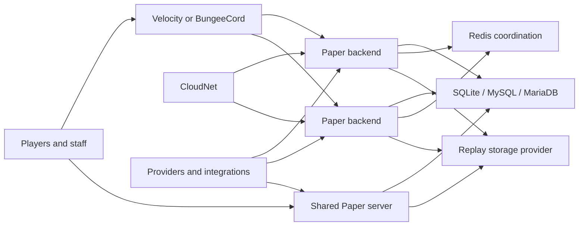
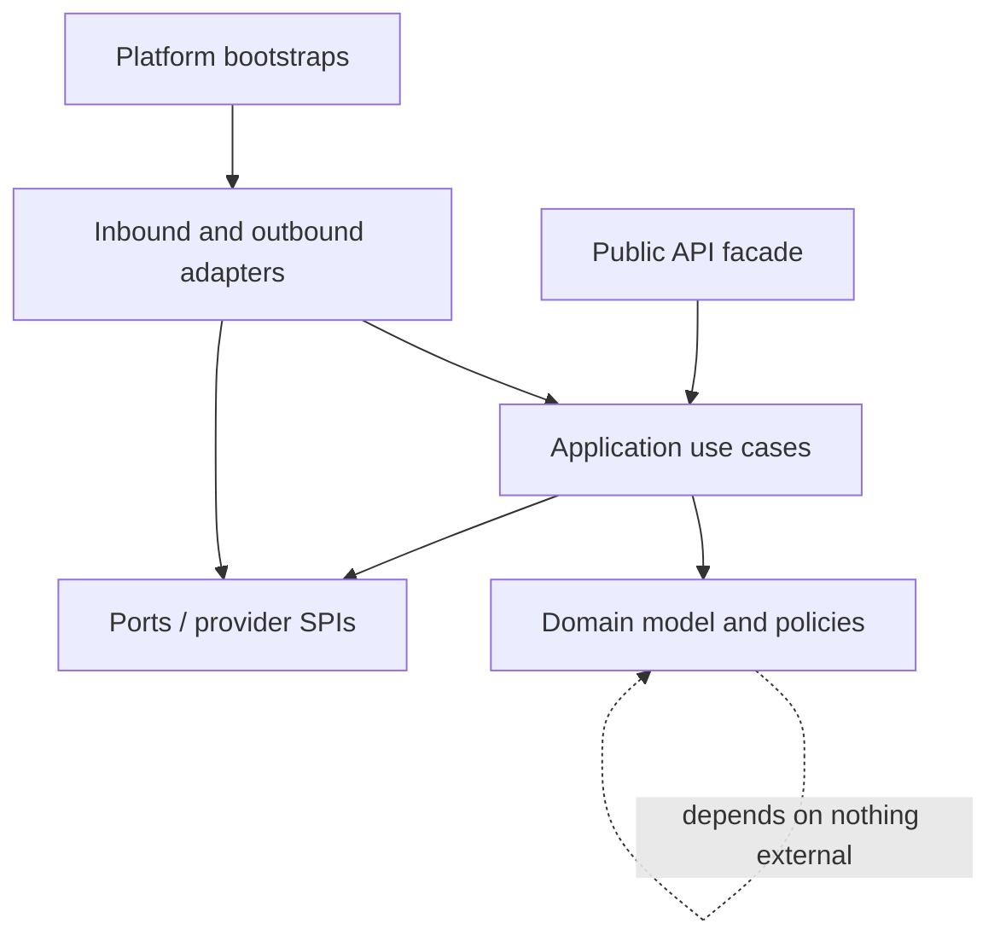

# ZartraBedWars Architecture

## 1. Architectural drivers

This architecture implements all 652 semantic requirements in the PRD and addon catalogue plus every normative `MP-L####` child in the atomic coverage matrix. Its primary runtime is Paper 1.21.1/Java 21; its compatibility design keeps all Bukkit, packet, material and provider details outside the domain so separately built adapters can cover server versions 1.8–1.21.x. It supports both `SHARED_SERVER` and `SCALABLE_PROXY`, high event volume, structured replay/evidence, multi-store persistence and an addon ecosystem.

Non-negotiable qualities are deterministic game behavior, no blocking I/O on a server tick thread, idempotent distributed mutations, bounded resource use, least privilege, secret redaction, schema/version compatibility and observable recovery.

## 2. System context and deployment

### Shared-server mode

One Paper process owns many arena instances and worlds. The arena scheduler partitions work by arena, limits simultaneous resets/loads, unloads inactive worlds and never assumes one arena per JVM. SQLite is allowed only here or in a single-writer utility role. The target inventory is 100+ configured arenas and 40+ managed worlds; the reference load test uses 10 active arenas.

### Scalable-proxy mode

Paper backends host one or more arenas/groups. The proxy is the ingress/router; Redis is the ephemeral coordination and invalidation plane; SQL is authoritative durable data; replay payload storage is separate. CloudNet is optional service discovery/scaling. Each backend advertises a versioned capability/health document and drains before removal. Cross-server queue, party, private-game, rejoin and play-again operations use the same domain services as shared mode.

No gameplay rule belongs in a proxy, Redis subscriber or CloudNet adapter. Those components route commands/messages into application ports.

## 3. Layering and dependency rule

- **Domain:** aggregates, value objects, policies, state machines, domain events. It imports no Bukkit/Paper/NMS, JDBC, Redis, proxy or plugin-provider types.
- **Application:** use cases, transactions, orchestration, authorization intents, idempotency and ports. It may depend on domain and stable API contracts.
- **Adapters:** Paper/proxy commands and listeners, repositories, Redis, providers, packets, GUIs and external APIs. They translate; they do not own business rules.
- **Bootstrap:** DI graph, lifecycle, capability negotiation and configuration. No service locator is visible to domain or addons.
- **Public API:** immutable DTOs/read views, commands/use-case facades, registration SPIs and documented events. Internal aggregates are never exposed.

Architecture tests reject cycles, adapter imports from domain, direct SQL outside storage adapters, Bukkit calls in async-only packages and internal implementation access across modules.

## 4. Planned Maven modules and boundaries

| Module family | Responsibility | May depend on | Forbidden ownership |
|---|---|---|---|
| `zbw-bom`, `zbw-build-tools` | Dependency alignment, quality plugins, reproducible packaging | None | Runtime behavior |
| `zbw-api` | Public services, DTOs, events, provider/extension contracts | Minimal annotations only | Bukkit/NMS/store implementations |
| `zbw-domain` | IDs, game/arena/player/team/shop/progression/replay/Atlas/stat policies | `zbw-api` contract subset | Platform and I/O types |
| `zbw-application` | Use cases, transactions, event pipeline, auth intents | API, domain | Provider implementation details |
| `zbw-config` | Typed schema, validation, versioning, reload plans | API, application ports | Feature business rules |
| `zbw-storage-api` | Repository/unit-of-work/migration/outbox ports | API/domain | JDBC driver specifics |
| `zbw-storage-sql` | SQLite/MySQL/MariaDB repositories, Hikari, migrations | storage API | Gameplay listeners |
| `zbw-redis-api`, `zbw-redis` | Versioned coordination contracts and Redis adapter | application ports | Durable source-of-truth decisions |
| `zbw-game`, `zbw-arena`, `zbw-world` | Game state machine and arena/world use cases | application/domain | Concrete world providers |
| `zbw-shop`, `zbw-progression`, `zbw-statistics` | Their domain policies, projections and use cases | application/domain | GUI/provider implementations |
| `zbw-content` | Versioned starter catalogues, configurable content packs, semantic effect IDs and provenance references | application/domain/config | Platform rendering or unlicensed asset files |
| `zbw-replay-api`, `zbw-replay-engine` | Replay model, capture/codec/playback/retention ports | application/domain | NMS packet code/storage backend specifics |
| `zbw-atlas` | Cases, anonymization, reservation, verdict/reputation/abuse policies | replay API, progression/reward ports | Punishment-provider implementation |
| `zbw-ui-api`, `zbw-ui-paper` | Page model and Paper inventory renderer | API/application | Feature rules or synchronous DB access |
| `zbw-command-api`, `zbw-command-paper` | Command tree, validation/help/audit adapter | API/application | Feature rules |
| `zbw-observability` | Health, metrics, Plugin Doctor, sanitized diagnostics | All health ports | Secrets or mutable domain state |
| `zbw-compat-api` | Materials/sounds/particles/items/scheduler/packets/capabilities | API | Version implementation |
| `zbw-compat-v1_8` … `zbw-compat-v1_21` | Narrow version-family implementations | compat API, matching compile API | Core business logic |
| `zbw-paper` | Paper bootstrap and standard assembly | application plus selected adapters | Domain duplication |
| `zbw-proxy-api`, `zbw-velocity`, `zbw-bungeecord` | Routing contracts and proxy bootstraps | API/message contracts | Game rules |
| `zbw-cloudnet` | Service discovery/scaling adapter | provider SPI | Queue/game policy |
| `zbw-integration-*` | PlaceholderAPI, Vault, LuckPerms, ProtocolLib, world, NPC, hologram, party, Grim, Vulcan, Via, Geyser/Floodgate adapters | Provider SPIs | Cross-provider business logic |
| `zbw-integration-discord-api` | Secure provider-neutral Discord DTOs, scopes, events and outbox contracts | Public API/application ports | Bot SDK or webhook implementation details |
| `zbw-integration-discord-webhook`, `zbw-integration-discord-external` | Optional embedded-webhook and external-bot adapters | Discord integration API | Gameplay authority or mandatory startup dependency |
| `zbw-sdk`, `zbw-example-extension` | Addon tooling, metadata validator and complete example | Public API only | Internal classes |
| `zbw-testkit`, `zbw-benchmarks` | Fakes, contract suites, E2E harness, JMH/load scenarios | Test scopes | Production activation |

Feature modules may be split further when package size or independent deployment requires it; the dependency direction remains unchanged.

## 5. Core domain model

- `ArenaDefinition` is configuration; `ArenaInstance` is a runtime allocation; `Match` is an immutable-identity state machine. A world is a leased resource, not arena identity.
- `MapId`, `ArenaId`, `MatchId`, `ReplayId`, `AtlasCaseId` and definition IDs are typed collision-resistant values. Display names are mutable localized data or snapshots.
- The match aggregate accepts commands and emits ordered events. State transitions are serialized per match; projections never mutate the match.
- `PlayerSession` separates saved pre-game state, network routing state and in-match state. Restore operations are idempotent.
- The shared event envelope contains event/operation ID, aggregate/version, match/server origin, timestamp and schema version. Progression, statistics and replay consume the same logical event but use independent idempotent projections.
- Money/reward/stat changes use explicit transaction records, never naked counter changes.

## 6. Provider abstractions

Every provider exposes `id`, semantic adapter version, supported capabilities, health, configuration validation and shutdown. Optional capability methods return typed `UNSUPPORTED`, never `null` or silent fallback.

| Port | Required operations and policy |
|---|---|
| `WorldProvider` | template import/export/clone/snapshot/load/unload/reset, selection/regions, capability and thread requirements |
| `SchedulerPort` | main/region/entity ownership dispatch, async CPU/I/O executors, deadlines and cancellation |
| `PacketPort` | client capabilities, fake entity/hologram/NPC/replay primitives, rate budget and safe destroy |
| `NpcProvider`, `HologramProvider` | stable provider-neutral definition CRUD, render/update/remove and migration export |
| `EconomyProvider`, `PermissionProvider`, `ChatMetaProvider` | quoted/atomic economy where possible; context-aware permissions/meta; cache invalidation |
| `PartyProvider` | party snapshot, membership commands/events and cross-server transfer intent |
| `AntiCheatProvider` | normalized alert subscription and metadata; never polling-heavy checks |
| `ProxyProvider` | backend registry, capability/health, transfer/reservation and signed messaging |
| `ServiceDiscoveryProvider` | service create/drain/stop, templates, capacity and health |
| `ReplayPayloadStore`, `ReplayTelemetryProvider` | streaming payload operations, integrity/retention/hold and sourced telemetry |
| `ExternalModerationProvider`, `ExternalStatsProvider` | scoped actions/queries with authentication, audit and rate limiting |
| `DiscordIntegrationProvider` | scoped account-link/stat/leaderboard/notification operations, versioned event delivery, health and optional no-op behavior |
| `ContentPackProvider`, `AssetProvenanceProvider` | versioned catalogue registration/override, schema validation, semantic asset lookup and provenance/licence approval queries |

Provider selection is config-driven. Startup rejects mutually incompatible mandatory providers; safe fallback is only permitted when declared by the port and shown in diagnostics.

## 7. Threading and scheduling rules

1. World, entity, inventory, scoreboard and player connection mutations run on the owning Bukkit/Paper or region scheduler context. A thread guard fails fast in test/dev builds.
2. SQL, Redis, HTTP, replay encoding/writes, filesystem clone/backup/import/export, compression and large calculations run on named bounded executors.
3. Async tasks operate on immutable snapshots/IDs. They may not retain live Bukkit objects. Results revalidate match/player version before applying on the owner thread.
4. Each match has a serial command lane. Cross-match work may run concurrently; the same match never has concurrent state mutation.
5. Queues declare capacity, rejection behavior, metric and shutdown drain timeout. Evidence replay and transactional outbox work receive reserved capacity.
6. Cancellation propagates on disconnect, arena abort and plugin shutdown. A timeout returns a structured error and cannot leave a half-applied domain transaction.
7. Map clone/reset is a pipeline: snapshot and file work async; world attach/unload and required provider calls on the documented owner thread; cleanup async only when the provider contract permits it.
8. Public APIs document caller thread and completion thread. Async APIs return completion stages/results; no hidden blocking join is allowed on the server thread.
9. Discord webhooks, external-bot delivery and custom providers consume a bounded transactional outbox on dedicated I/O executors. Provider timeout, retry exhaustion or circuit opening never delays a match lane or server tick.

## 8. Persistence and consistency

### SQL

SQL is authoritative for identities, player/progression/statistics, configuration metadata, audit, replay metadata and Atlas cases. Repositories are aggregate-oriented; prepared statements and explicit transactions are mandatory. Schema changes are ordered, checksum-verified migrations. Before destructive migration, create and validate a backup. When DDL cannot roll back transactionally, rollback means restore/forward-repair with a tested runbook.

SQLite uses a serialized write lane and WAL where supported. MySQL/MariaDB use HikariCP, timeouts, deadlock-aware bounded retry and indexed query plans. No SQL exists in gameplay/GUI/command classes.

### Transactional event flow

Authoritative mutations write domain data plus an outbox record in one SQL transaction. Dispatch is asynchronous and at-least-once. Every consumer stores/recognizes event IDs; therefore projections and rewards are idempotent. An inbox/outbox recovery worker resumes after crash. Administrative corrections use append-only audit and compensating transactions rather than history deletion.

### Cache

Caches are bounded, metricized and keyed by typed IDs. Entries carry data/schema version and TTL. Cache miss on the tick thread returns a safe cached/unavailable result and schedules refresh; it never blocks on storage. Redis invalidation removes stale local entries, but SQL remains authoritative.

## 9. Redis and distributed coordination

Redis key names include installation namespace, environment and schema version. Pub/Sub is used for disposable invalidations/announcements; Streams/outbox-backed delivery is used when replayable delivery matters. Locks use unique fencing tokens, TTL and bounded acquisition; they never substitute for SQL constraints. Leader election is limited to singleton schedulers such as global season rollover.

Messages are versioned envelopes with message/operation ID, producer, timestamp/deadline and payload type. Consumers deduplicate and accept current plus declared previous schemas during rolling upgrades. Reconnect uses exponential jittered backoff and circuit breaking. When Redis is unavailable, cross-server admission/finalization that cannot be made safe is paused; local non-distributed play may continue only under the configured, documented degradation policy.

## 10. Proxy and CloudNet protocol

Backend heartbeats publish server ID, instance epoch, supported protocol/API versions, arena capacity/state, accepting/draining flag and health. A reservation has an ID, expiry and single-use transfer token. The proxy verifies signed plugin messages, size/schema/replay protection and destination capability. Transfer retry is bounded and falls back to the configured lobby.

CloudNet consumes desired capacity derived from queue and warm-pool policy. Scale-down marks a service draining, removes new routing, finishes/transfers active sessions, flushes outbox/replay work and then stops. A crash replacement never assumes unflushed local state is authoritative.

## 11. Replay and Atlas architecture

The Paper capture adapter turns tick-safe snapshots and domain/provider events into a per-match bounded buffer. The replay engine assigns sequence/time, delta-encodes, compresses and streams chunks asynchronously. A manifest references immutable chunks plus checksum tree, format version and classification metadata (`EXACT`, `SAMPLED`, `ESTIMATED`, `DERIVED`, `UNAVAILABLE`). Finalization is atomic at manifest level; incomplete manifests are recoverable/quarantined.

Replay metadata lives in SQL; payloads use `ReplayPayloadStore`. Retention evaluates legal hold, open staff/Atlas/report status before ordinary age/size rules. Evidence workloads have reserved queue/storage budget; emergency degradation may reduce ordinary sampling or disable non-evidence recordings but cannot silently discard evidence.

Playback uses a version-neutral scene model. A compatibility renderer maps scene entities/items/particles/packets to the viewer client/server capabilities. Timeline and telemetry read indexed chunks without loading an entire replay. Viewer sessions are isolated worlds/virtual scenes and cannot affect live matches.

Atlas stores real identity in restricted case data and a separate anonymized projection. Reservation is atomic with TTL and conflict checks. Review interaction telemetry is bounded and purpose-limited. Verdict aggregation, reputation, rewards and staff enforcement are separate policies; community output cannot directly invoke permanent punishment under default policy.

## 12. Minecraft 1.8–1.21.x compatibility

The primary modern artifact is built/tested for Paper 1.21.1 on Java 21. Supporting old server runtimes in one JAR is technically unsafe because JVM baselines and APIs differ. The architecture therefore permits a distribution family:

- shared domain/protocol source and schemas with the lowest viable bytecode/library subset determined by ADR;
- modern Paper bootstrap/adapters using Java 21;
- legacy bootstrap/adapters compiled with the server's supported JDK/toolchain;
- version-family compatibility modules selected at build/bootstrap, never reflective version switches scattered in core;
- a capability matrix for material names/data values, PDC versus legacy NBT, sounds, particles, titles/bossbars, inventory behavior, Adventure/RGB downgrade, scheduler, entity/packet metadata and client protocol;
- ProtocolLib when compatible, with an internal packet port and narrow direct packet adapter only where necessary;
- ViaVersion/ViaBackwards/ViaRewind for client-protocol compatibility, never as a substitute for server API adapters;
- Geyser/Floodgate input capability detection and Bedrock-safe interaction routes.

No version adapter changes game rules. Contract suites run against every supported server/provider matrix; a version is declared supported only after the matrix passes. “Latest stable” is a moving target added through a new adapter/matrix row, not a claim of untested automatic compatibility.

Minecraft 1.8 is a mandatory server-runtime target, not merely a client-protocol target. Every visual or platform capability resolves through `zbw-compat-api` to a tested native, emulated or legacy-equivalent implementation documented in [COMPATIBILITY_FALLBACKS.md](COMPATIBILITY_FALLBACKS.md). An adapter must reject or replace unsupported materials, particles, sounds, entities, packets, text and inventory components before they reach the platform. Gameplay remains intact; only a purely decorative effect with no safe equivalent may be suppressed, with an explicit matrix row and diagnostic.

## 13. GUI, commands, authorization and localization

Feature modules publish declarative page and command models; platform adapters render/execute them. GUI loads bounded pages asynchronously and revalidates permission/version when clicked. Destructive actions require a confirm token tied to actor/action/target/expiry. Command and GUI paths call the same application use case.

Permissions are action/resource nodes, resolved through an authorization port; role labels are documentation only. Sensitive reads and mutations emit sanitized audit records. Localization uses message keys and typed parameters; MiniMessage/RGB is rendered to client capability with deterministic legacy fallback.

## 14. Security and privacy architecture

- Threat boundaries: player input, commands/chat, plugin messages, Redis, SQL, HTTP/Discord, configs/imports, replay payloads and third-party provider callbacks.
- Validate length/type/range/schema/authorization at adapters and domain invariants again in use cases.
- Use prepared SQL, TLS/auth where supported, signed/replay-protected proxy messages, scoped external API credentials, rate limits and bounded payloads.
- Secrets use references/environment/protected files and central redaction. Sanitized diagnostic export has an allowlist, not a blacklist.
- Discord bot credentials are never required by the Minecraft runtime and are resolved through the secrets port; normal configuration stores only secret references. Discord providers are optional, circuit-broken and unable to mutate gameplay outside explicitly authorized application use cases.
- Assets and content resolve through stable semantic IDs. Packaging fails unless every distributed file has an approved provenance row and every third-party dependency has an exact-version licence decision.
- Currency/reward/stat/case operations use idempotency keys, uniqueness constraints and audit trails.
- Replay/chat/profile/Atlas data has purpose, visibility, retention, export/deletion and legal-hold policy. Deletion anonymizes evidence that must legally be retained rather than violating an active hold.
- Script/custom action hooks are disabled by default and run only through allowlisted, permissioned actions with time/resource budgets; arbitrary JVM/shell execution is not a supported configuration feature.

## 15. Observability, failure and performance

Every provider and bounded resource exports health, saturation, errors, latency and version/capability. Metrics use bounded labels (never raw player/map IDs by default). Slow operations include trace/correlation IDs. Plugin Doctor aggregates sanitized checks and suggested actions.

Failure results distinguish unavailable, timeout, rejected, conflict, invalid, unauthorized, corrupt and unsupported. Retriable operations have bounded exponential backoff; non-idempotent work is never blindly retried. Circuit breakers expose state. Shutdown stops admission, drains matches/outbox/replay within configured deadlines, persists recovery markers and releases providers in dependency order.

Performance gates use the PRD budgets and a reproducible workload/hardware manifest. Profiling reviews allocations, heap retention, thread/queue counts, chunk/entity load, query plans, Redis traffic, placeholder calls and packet/effect rates.

## 16. Testing architecture

- Pure domain UT with deterministic clock/ID/randomness.
- Provider contract suites reused by every SQL, Redis, proxy, world, NPC, hologram, party, anticheat and replay store adapter.
- Paper E2E harness for lifecycle, GUI/commands/permissions and version matrices.
- Containerized MySQL/MariaDB/Redis integration and partition/restart/rolling-upgrade chaos tests.
- Golden replay format/playback tests plus corruption/fuzz/privacy tests.
- Atlas anonymization/conflict/abuse/reward/staff-safety tests.
- JMH microbenchmarks and scenario load harness for the PRD matrix.
- Architecture/static tests for forbidden dependencies, API compatibility, docs/config/command/permission/placeholder inventories and no production TODO/stub markers.
- A deterministic documentation gate hashes `MASTER_PROMPT.md`, assigns one stable `MP-L####` entry to every non-empty source assertion, validates every mapped `ZBW-*` ID against the PRD and requires all requested audit categories plus exactly 100% `COVERED` status before any Java module may be introduced. The generated Markdown is Part II of traceability, not a best-effort report.
- Decision-document validation proves RC-072–RC-076 IDs exist in both PRD and traceability, the Resource Scarcity addon children remain append-only, accepted ADRs and required catalogues exist, and the published requirement totals agree.

## 17. Build, packaging and compatibility artifacts

Maven toolchains compile each runtime line with its required JDK. The BOM pins dependencies; reproducible builds create checksummed Paper, Velocity, BungeeCord, CloudNet, API, docs and example artifacts. Optional integrations are `provided`/isolated and detected through bootstrap adapters. The documentation-only atomic coverage verifier requires Python 3.11+ and the standard library; M01 pins its CI patch version, and it is not shipped in runtime plugin artifacts. CI tests primary target on every change and the broader compatibility matrix on scheduled/release workflows. Dependency/license/vulnerability reports and the atomic-coverage verification result are release inputs.

The dependency gate in [DEPENDENCY_LICENSE_AUDIT.md](DEPENDENCY_LICENSE_AUDIT.md) is default-deny: an exact artifact, version and checksum must have verified source, licence, redistribution, shading, modification, attribution and commercial-use decisions before it may enter a build or release. `UNSELECTED`, `UNKNOWN` or contradictory metadata blocks selection or bundling. Official integration APIs are compile-only/provided where feasible; proprietary plugin binaries are never stored or redistributed. Release notices are generated from the approved dependency and [asset provenance](ASSET_PROVENANCE.md) manifests.

## 18. Decision state before implementation

RC-072 through RC-076 are accepted in ADR-0001 through ADR-0005: Resource Scarcity is the original eleventh Private Games modifier; original/licensed starter content is externally configurable; Discord uses optional providers; Minecraft 1.8 uses mandatory compatibility adapters and fallbacks; dependency and asset redistribution are default-deny until verified.

The remaining pre-code ADR queue in `docs/RISKS_AND_CONFLICTS.md` includes exact runtime/provider versions and licences, reference benchmark hardware/workload, canonical permission/command namespace, data privacy jurisdiction/retention, replay fidelity/storage defaults, distributed consistency policy and scripting sandbox. Content production must still reach the requested 300+ cosmetic catalogue during its milestone, but its originality/provenance policy is no longer undecided. These decisions refine implementation; none removes the corresponding PRD capability.
