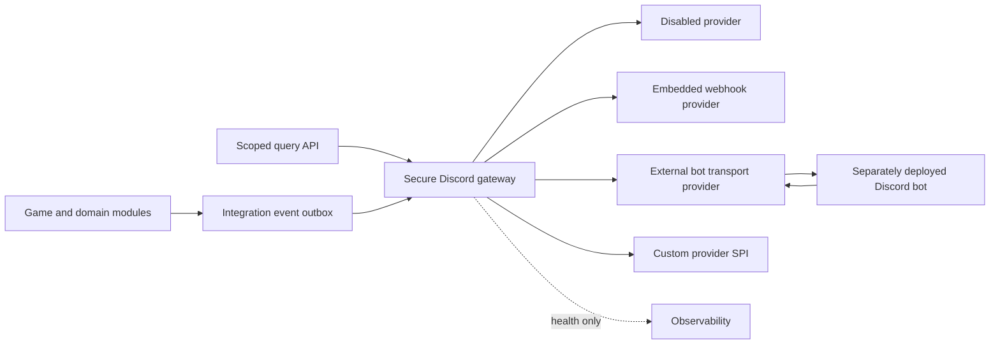

# Discord Provider Architecture

**Status:** accepted pre-implementation decision 
**Decision:** RC-074 
**Requirements:** `ZBW-DISCORD-001..008` 
**Implementation status:** M02 API/SPI CONTRACTS VERIFIED; provider/runtime behavior remains M03/M05/M16

## 1. Decision

ZartraBedWars uses a provider-based Discord integration. The Minecraft plugin owns a secure internal integration API and an outbound event stream. The Minecraft plugin must not require a Discord bot to install, start or run. Discord is optional: with no provider configured or healthy, all gameplay, persistence, rewards, queues and match completion continue normally. Discord failures must not affect gameplay.

Three providers are mandatory:

1. **Embedded webhook provider** for simple outbound notifications only.
2. **External Discord bot provider** for commands, statistics, leaderboards and verified account linking.
3. **Custom provider API** for operator or third-party implementations.

A built-in disabled/no-op provider is the default and is also tested.

## 2. Boundaries

| Component | Module/deployment | Responsibility | Forbidden responsibility |
|---|---|---|---|
| Integration contracts | `zbw-api`, `zbw-application` | Typed event/query/auth contracts and sensitivity metadata | Discord SDK classes or bot tokens |
| Gateway/provider SPI | `zbw-integration-discord-api` | Provider lifecycle, capability negotiation, bounded delivery and health | Game state mutation or direct repositories |
| Embedded webhook adapter | `zbw-integration-discord-webhook` | Outbound HTTPS webhook messages | Slash commands, account linking or inbound server |
| External bot transport | `zbw-integration-discord-external` | Authenticated request/event transport to a separate bot | Bot token storage or Discord SDK in Paper process |
| External bot | Separately packaged/deployed artifact | Discord commands, embeds, linking UI and rate-limit handling | Direct Minecraft world/game mutation |
| Custom provider | Extension using public SDK | Implements declared provider capabilities | Internal class access or bypass of scopes/redaction |

The module names refine the `zbw-integration-*` boundary already defined in `docs/ARCHITECTURE.md`.

## 3. Internal API and event stream

### 3.1 Event envelope

Every outbound event contains:

- immutable event ID and idempotency key;
- schema version and event type;
- occurrence time plus correlation/match IDs;
- typed stable IDs rather than mutable display names as identity;
- sensitivity classification (`PUBLIC`, `LINKED_ACCOUNT`, `STAFF_RESTRICTED`, `PROHIBITED_EXTERNAL`);
- minimum provider capability and destination policy;
- locale-neutral typed payload; rendering occurs in the provider;
- retry count/deadline and trace metadata without secrets.

Only allowlisted event types can leave the plugin. Raw chat, secret values, replay evidence, Atlas identities, anticheat details and staff notes are denied unless a separate requirement explicitly allows a scoped provider and privacy review. `PROHIBITED_EXTERNAL` events never cross the gateway.

### 3.2 Query API

The secure query API exposes bounded, read-only operations for:

- public/consented player statistics;
- leaderboards with pagination and freshness metadata;
- account-link challenge creation, verification and revocation;
- provider health and supported capability discovery.

Every request has an authenticated caller, scopes, target UUID policy, page/field limits, timeout, correlation ID and audit outcome. The bot cannot submit rewards, mutate matches or write statistics through this API.

### 3.3 Provider contract

The public provider SPI supplies lifecycle (`start`, `drain`, `stop`), declared capabilities, asynchronous delivery, health, retry classification and sanitized diagnostics. Provider callbacks run off the Minecraft owner thread and return typed results. Custom providers pass the same contract, security and failure tests as built-ins.

## 4. Provider behavior

### 4.1 Embedded webhook

- Supports configured notification event types only.
- Uses outbound HTTPS with host allowlists, connect/request timeouts, payload/queue limits and redacted logging.
- Resolves the webhook URL through `SecretRef`; the normal YAML contains only the secret reference name.
- Coalesces or drops low-priority decorative messages under backpressure according to documented policy; durable/relevant messages use the bounded integration outbox.
- Has no inbound listener, slash commands, player linking or bot token.

### 4.2 External bot

- Runs outside the Minecraft JVM and owns the Discord bot token.
- Implements commands for statistics, leaderboards, profiles, diagnostics and verified account linking.
- Connects through authenticated encrypted transport. The concrete M16 ADR must choose mTLS or short-lived signed service credentials; plaintext or static unauthenticated transport is forbidden.
- Uses nonce/timestamp replay protection, scoped service identity, request size/rate limits and key rotation.
- Receives events idempotently and acknowledges them only after durable acceptance.
- Returns no Discord SDK object across the internal API.

### 4.3 Custom provider

- Registers through the public extension metadata/SDK and declares capabilities.
- Is disabled when its API version, required scopes or configuration are incompatible.
- Cannot request more data than the canonical API exposes and receives no secret values belonging to another provider.
- Must pass provider contract, timeout, redaction, rate, shutdown and failure-isolation tests.

## 5. Optionality and failure isolation

Provider delivery is never part of the gameplay transaction. Domain events commit first; the integration outbox observes committed events. A full queue, Discord outage, HTTP timeout, bot restart, invalid response or provider exception may change only integration health/delivery state.

The gateway uses bounded queues, deadlines, exponential backoff with jitter, circuit breakers, per-destination rate limits and shutdown drain. It exposes metrics for accepted, delivered, retried, dropped-by-policy, dead-lettered, latency, queue depth and circuit state. It never blocks the Paper tick thread and never retries forever.

Gameplay must pass E2E tests with all Discord providers absent, disabled, timing out, returning errors and crashing during match completion.

## 6. Secrets and configuration

Normal configuration contains provider type, enabled flag, destination/channel allowlists, event allowlists, locale/format IDs, timeouts, queue/rate budgets and secret reference names. Webhook URLs, bot tokens, service keys and private endpoints are secrets.

Resolution order is an approved secrets provider, protected environment variable, then an explicitly configured protected secret file only if an ADR permits it. Secrets are never exported, shown in GUI/placeholders, committed, included in exception text or written to debug bundles. The external bot token never belongs in the Minecraft plugin process.

## 7. Product surfaces

| Surface | Canonical plan |
|---|---|
| Configuration | `integrations/discord.yml` plus environment/secret references |
| Player GUI | Account-link, consent, unlink and visibility controls |
| Admin GUI | Provider capability/health, queue, circuit, destination and redacted diagnostics |
| Commands | `/zbw discord link|unlink|privacy|status`; `/zbw admin discord validate|reload|diagnose|drain|retry` |
| Permissions | `zartrabedwars.discord.link`, `.privacy`, `.status`; `zartrabedwars.admin.discord.*` |
| API/events | `DiscordIntegrationApi`, `DiscordProvider`, `DiscordEventEnvelope`, link/provider/delivery lifecycle events |
| PlaceholderAPI | Link state and sanitized provider health only; never secrets, external IDs without consent or queue payloads |
| Documentation | Operator setup per provider, external-bot protocol, custom-provider SDK, privacy and troubleshooting |

## 8. Acceptance tests

- Provider contract tests for disabled, webhook, external and sample custom providers.
- No-provider full gameplay and startup E2E.
- Outage, timeout, rate-limit, malformed response, queue saturation, restart and shutdown tests.
- Event idempotency, ordering expectation and dead-letter recovery tests.
- Scope, account-link challenge, replay prevention, privacy, consent, deletion, token-redaction and destination-allowlist security tests.
- Thread guard showing zero HTTP/IPC wait on the Minecraft owner thread.
- External protocol version compatibility and rolling-upgrade tests.

RC-074 is resolved at design/specification level by this document. Provider runtime implementation remains gated on M03/M05 foundations and the exact external transport credential ADR before M16.

M02 now supplies `DiscordIntegrationApi`, immutable `DiscordEventEnvelope`, `DiscordProvider` and `DiscordCapabilities` in `zbw-integration-discord-api`. These contracts cover typed identity, idempotency, sensitivity, read-only query scope/deadline, provider capabilities, asynchronous lifecycle and typed delivery classification. No webhook, bot transport, no-op runtime, secret resolver, outbox/retry engine or Discord SDK has been implemented; those remain assigned to M03/M05/M16.
